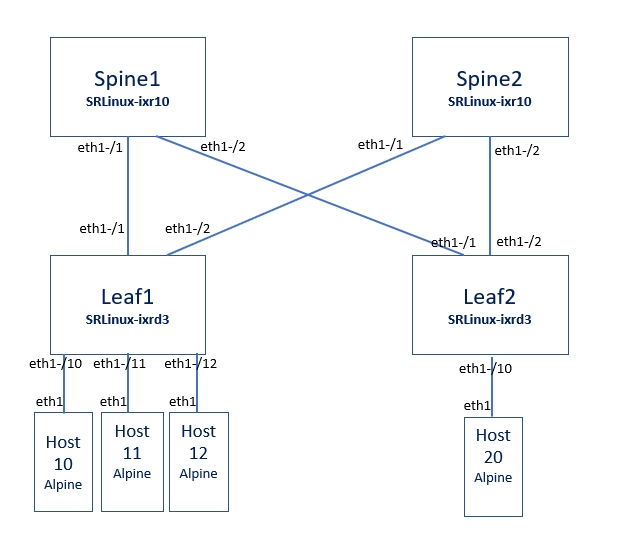

<h1>Container Lab Setup for DC Fabric Fundamentals Training</h1>

This is to setup the lab environment for the Nokia DC Fabric Fundamentals Training, using the containerlab, as below

To install containerlab (CentOS 7)
> yum-config-manager --add-repo=https://yum.fury.io/netdevops/ && echo "gpgcheck=0" | 
> sudo tee -a /etc/yum.repos.d/yum.fury.io_netdevops_.repo  
>
> yum install containerlab

To setup the training lab environment
> cd /  
> git clone https://github.com/muzafferkahraman/dcfabric_training_lab  
> cd dcfabric_training_lab  
> containerlab deploy --topo muzolab.yml  

After the script runs sucessfully, a  <b>docker ps -a </b> check should return an ouput like below

You can connect to each node (ie host-11) by 
> docker exec -ti clab-muzolab-host11 bash

Alpine Linux hosts' eth1 interfaces also need to be provisioned  
You can do that by running the example command below for each host

> ifconfig eth1 192.168.101.2 netmask 255.255.255.240 broadcast 0.0.0.0

This will have installed an empty configuration.
If you wish to start your container environment just the same as the actual lab environment, you have to add some configuration in advance.
for each srlinux node copy and paste the related command file
ie for leaf1: leaf1 infoflat.txt

<b>Important Note</b>
after logging in the srlinux containers, to switch to srlinux environemnt, type
>sr_cli

